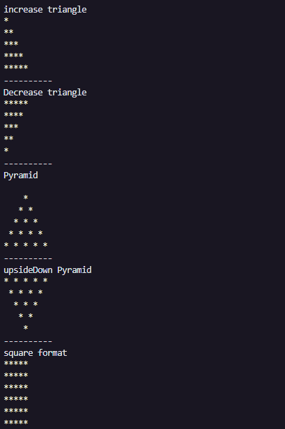

# Star patterns using for loops
Star pattern is a programming concept that is used to display a pattern of stars. \
I started this programm to practice Javascript **for loops**.
<br />
<br />
Some patterns I did: 
<br />


To run this code it is necessary to have Node installed. <br />
OR <br />
Add a index.html and includes javascript to it, then install the **live-server** extension os VSCode, run the code in the browser's console.

With Node run this:
```cl
node patterns.js
```
